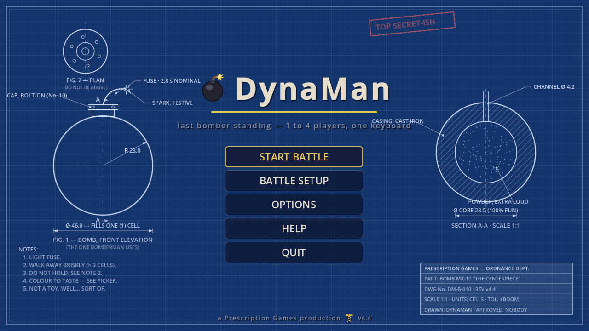
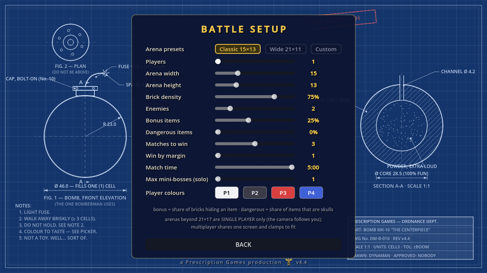
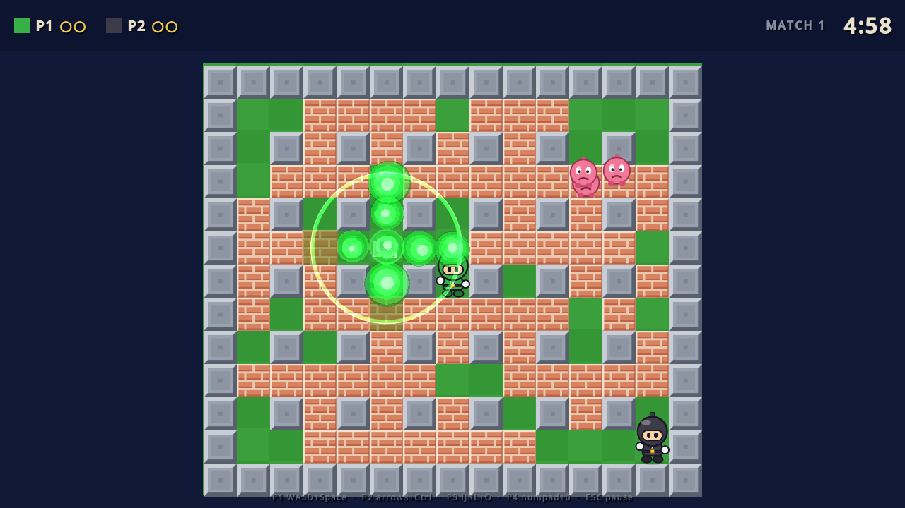
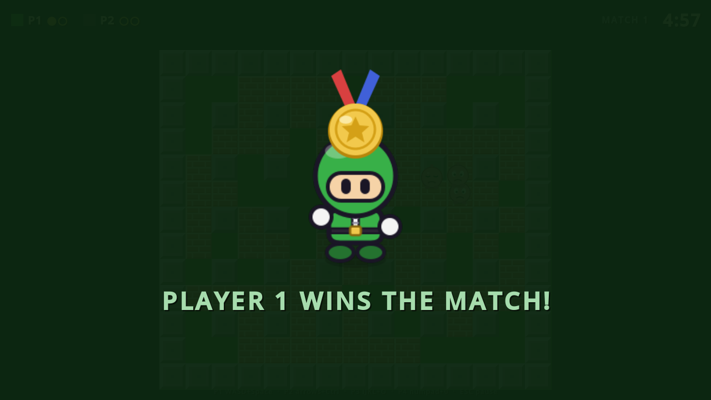

# DynaMan

*a Prescription Games production* · v12.6
<!-- version convention: bump by 0.1 with every shipped change (keep in
     sync with VERSION in scripts/ui/startup.gd) -->

**Last bomber standing.** A lean, maximum-fun **Dynablaster (1991)**
battle-mode clone for **Godot 4.7** — no story mode, just the good part:
1–4 players on one keyboard (gamepads supported), bombs, bricks,
power-ups, skull curses, and a bestiary of enemies as the wildcard. A configurable
best-of (with optional win-by-2) takes the battle. Solo (v3.9) is an
arcade hunt: kill every monster, then find the exit portal hidden under
a brick and step through to escape. Watch for the rare bomber monster —
a planner-brained mini-boss in a random colour that hunts, tunnels, and
bombs like a player. And whatever you do, don't bomb the doorway: the
portal answers every hit with a fresh mini-boss (v4.0) — and bosses
know it. A walled-off boss below the cap flips a coin: 50/50 between
bombing the door for reinforcements and mining bricks toward you
(v4.3; cap defaults to 1, slider goes to 5).

All-vector art in the Dynablaster palette, every sound synthesized at
startup, generative background music, everything built in code — down
to the main-menu backdrop, a joke engineering blueprint of the bomb
(three projections, dimension arrows, hatched section, TOL: ±BOOM).
Full design in [docs/DESIGN.md](docs/DESIGN.md).

## Screenshots

| | |
|---|---|
|  |  |
|  |  |

## Battle setup (all in-menu, all persisted)

- **Players** 0–4 — yes, zero: the **demo mode** (v4.6) is an attract-mode battle of 2–4 bots that loops on its own (Q returns to the menu) · **Arena** 9–31 × 9–25 (odd; beyond 21×17 = solo-only, camera follows you)
- **Bots** (v4.6): a 1-player game can invite up to 3 AI bombers — 0 keeps the classic solo arcade hunt; any more and it's a battle, last bomber standing. Bots run on the mini-boss planner brain: they flee blasts, verify an escape before every bomb, tunnel toward you and grab power-ups on the way.
- **Fill empty seats with bots** (v7.6): a toggle that tops a 2- or 3-human battle up to a full four with AI bombers (2 humans → 2 bots, 3 humans → 1) — a crowded arena even when the couch is half empty.
- **Brick density** 10–95% · **Enemies** 0–12 — multiplayer keeps the classic balloon/chomper pair; **solo fields a 20-type menagerie** (v6.8) in five difficulty tiers: slimes that split, goo-painting snails, wall-hopping frogs, burrowing moles, loot-eating thieves, bomb-swallowing munchers, players get FROZEN by freezers, mimics disguise as the arena's own bricks, warlocks summon reinforcements, bulls charge down lanes — and three MULTI-TILE serpents that drag their bodies snake-game style: the choppable Snake, the armored Centipede, and the fire-breathing three-hit Dragon
- **Bonus items** 0–60% of bricks · **Dangerous items** 0–60% of items (skulls)
- **Rounds to win** 1–5 · **Win by margin** 1–2 (deuce rule) · **Round time** 1:00–5:00 · **Max mini-bosses (solo)** 1–5 — one arena is a **round**, the whole series is the **battle** (v4.7 wording)
- **Sudden death** (v4.5, off by default): the last 45 s of a multiplayer
  round closes the arena — pressure blocks spiral in and crush everything.
- **Revenge** (v10.2, setup toggle, off by default): the fallen ride the
  **border rim** and lob real bombs back in (owner-credited, flame 2,
  cooldown-gated) — nobody waits out a round on the couch. Bots ride the
  rim too.
- **Teams 2v2** (v10.2, setup cycler): the three ways four bombers pair
  up (P1+P2, P1+P3 or P1+P4 vs the rest). The round ends when one TEAM
  stands; wins credit both members in lockstep, so best-of series,
  win-by-2 and BATTLE POINT all just work; HUD, tags and ceremonies
  speak team ("TEAM P1 + P3 WINS THE BATTLE!"); teammate bots hunt only
  the enemy. Needs exactly four bombers — anything else falls back to
  free-for-all with a countdown note.
- **Bot difficulty** (v10.2, setup cycler): Easy / Normal / **Hard**
  (the default — the classic planner brain untouched). Easier bots
  re-plan slower, bomb less eagerly and run a step behind.
- Always on (v4.5): the last 30 s pulse the clock red and push the music a
  step up; a **BATTLE POINT** strip names whoever is one round win from the battle;
  chain reactions RIPPLE like the original (v12.1): a bomb caught in a
  blast goes off a beat (~0.11 s) later, so a row pops bomb by bomb —
  and each pop plays its own beat in sync, "bo bo bo bo bo BOOM", the
  full boom on the bomb that ends the chain; separate bombs going off
  together each keep their full boom (v12.0). A burning brick is solid
  and blocks fire until it's gone, a chain never torches the item (or
  doorway) it uncovered itself, and the round waits for a running chain —
  a chain that takes both of you is a draw (v12.2).
- **Player colours** full colour-map picker per player (classic palette as quick presets) — suit, bombs, flames, explosion particles and victory splash all follow the chosen tint
- **Bomb styles per seat** (v8.9): right under the colour row, each seat cycles **G** (follow OPTIONS → Bomb style) → the six costumes, previewed as that player's own tinted bomb — so the couch can field a potion-thrower against a naval-mine admiral while everyone else stays on the global pick
- **Gamepad rumble** (v4.6): your pad thumps with every nearby blast and lets loose when you die (pad N drives player N, as ever)
- **Arena tile skins** (v4.8, **50 of them** since v4.9, OPTIONS → Arena tiles with a live preview): the classics and accessibility looks (Eye relief is a calm dark sage; Ultra contrast shouts on purpose), a world tour (Marble, Space station, Woods, Forest, Hedge labyrinth, Garden, Mine, Desert, Mountain, Volcano), fifteen colour-theory beauties (Ocean, Sunset, Sakura, Lavender fields, Autumn, Nordic, Jade temple, Terracotta, Glacier, Honeycomb, Vineyard, Copper patina, Midnight gold, Savanna, Rose quartz), five pastels (Mint, Peach, Sky, Lilac, Candy shop), four art homages (Mondrian, Starry night, Water lilies, Great wave), Casino royale, and ten fantasy locations (Gingerbread, Atlantis, Moon base, Crystal cavern, Mushroom grove, Clockwork, Haunted yard, Cloud kingdom, Neon city, Pirate cove). Every skin re-themes walls, floor checker AND the destructible — logs, bushes, magma, tombstones, barrels, gingerbread men... Turn on **Random arena** and every round redraws the world in a fresh skin.
- **The ARENA THEME MAKER** (v9.1, gold-trimmed button in OPTIONS next to the Arena tiles wheel): build your **own named arena themes** — wall and brick from a **thirty-two-shape library** (v9.5 — beveled block, brick courses, timber planks, riveted panel, cobblestone, crossed crate, ice block, honeycomb, shingles, bamboo, sandstone, circuit board, basket weave, stained glass, moai wall, dragon scales, trellis, boulder, bush, crystal, cloud puff, barrel, cogwheel, toadstool, cut gem, pumpkin, seashell, cactus, lantern, stone head, dragon egg, treasure chest) in **your colours** (tints derived from one base each, the wall-vs-brick legibility rule auto-enforced), **or your own PNG images** as wall/brick; a floor tone (checker pair derived) and a music mood; **THE DIE** — just the die itself since v9.3, big and central, spinning with a pop when thrown — rolls colour-theory harmonies with names dealt from 32 adjectives x 32 nouns (v9.5 added a literary sixteen of each: "Gossamer Scriptorium", "Wuthering Necropolis"...); a **Your themes** row browses everything you saved with LOAD and DELETE for the ones that did not work out; **CLASSIC** (v9.4) puts the original grey-bevel/red-brick/green-floor look on the bench as home base to tweak from. Since v9.8: **PADLOCKS** on every row (NPC-Studio style) make locked fields THE DIE's no-go zones — lock your colours and roll shapes, or the reverse; **TRY IT** plays a real quick round (you + one bot) in the *unsaved* bench theme and Q brings you straight back to the bench; **SAVE COPY** forks the bench into a new theme; BACK/ESC returns to OPTIONS; saved names keep exactly what you typed except spaces become underscores, twins get numerals ("Twin_Peak_II"); and **Random arena** gains a scope — draw from everything, the shipped 50, or your themes only. Saved themes join the Arena tiles wheel and the Random pool like any built-in, and **share as `.dynarena` files** (EXPORT/IMPORT — one theme or a pack, embedded PNGs travel along).
- **Bomb styles** (v5.1, OPTIONS → Bomb style, with preview): Classic sphere, Dynamite trio (three bound sticks, trembling), Naval mine (spiked, slowly spinning), Aero fin (tail-finned, balancing on its nose), the ACME special — one comically fat dynamite stick with the proud label and an extravagant fuse, rocking like it knows what it is — and the **Potion bottle** (v6.0): corked glass, no wick, your colour bubbling inside; the brew boils harder as time runs out, the cork pops half a second before the end, and then it simply... concludes. Pure cosmetics: fuse, blast and kick behave identically in every costume, and all five wear the owner's colours.

v6.5-v6.7: menus fully navigable by **keyboard, gamepad and mouse** (gold
focus ring, d-pad/stick + A/B wired); **per-skin music moods** — seven
scales/tempos across the 50 arenas, so Random arena is a travelling
soundtrack; and DynaMan ships for the web — grab the itch.io zips in
`build/itch/`.

New in v6.3: the battle-end trophy card shows **per-player stats** (wins,
bombs, bricks, KOs, items); draws get a proper **ceremony** (everyone lies
down, nobody gets a medal); **Blast range hint** in OPTIONS (off by default)
pulses every cell a ticking bomb will reach; and with Random arena on, the
countdown announces each round's world.

**Hold H in battle** (v6.1) for the quick-help overlay: your controls, the
system keys, the full power-up legend and the round's goal — high-contrast,
gone the moment you let go. The game keeps running; peeking is a tactic.
Since v9.0 each player row also shows that seat's **bomb in its costume
and tint**, so you can check who throws what mid-melee.

## Controls

| Player | Move | Bomb |
|---|---|---|
| P1 | W A S D | Space |
| P2 | arrows | Ctrl |
| P3 | I J K L | O |
| P4 | numpad 8 4 5 6 | numpad 0 |

Each player also accepts a gamepad (by default pad N drives player N:
d-pad / left stick + A).
Note for 4-on-one-keyboard: cheap keyboards ghost when many keys are held
at once — if inputs vanish in pile-ups, spread players onto gamepads.
`Esc` pause · `R` rematch (paused / match over) — during a round's
ceremony `R` skips straight to the next round, tally intact · `Q` quit
to menu (paused / match over) · in the zero-human DEMO and the maker's
TRY IT, `Q` leaves anytime. On a gamepad: **START** pauses / resumes
(and leaves the trophy screen), **BACK** quits to the menu, **Y** is `R`
— a pad-only couch never needs the keyboard (v11.8).

**Gamepads, remapped in game (v12.5)** — OPTIONS → CONTROLS → GAMEPADS:
**CLAIM** a player, then press any button on the pad that should drive
it (the pad rumbles; whoever had it takes the old one — handy when a
Steam Deck plus an extra controller should be P2 and P1); remap each
player's **BOMB** to any button or to a trigger (LT / RT); remap the
shared **PAUSE / QUIT / REMATCH** buttons for every pad; set the **stick
dead zone** against drifting sticks; **RESET PADS**. Each pad shows
whether it's connected and its name. The d-pad stays movement, and a
bomb can't sit on a system button (or vice versa) — refusals say why.
An armed slot waits 6 s; ESC keeps the old binding (and B backs out of
a CLAIM). Triggers bomb only. All of it is saved. If a claimed pad isn't
there, its player plays on a free pad in seat order (a Steam Deck's own
controls always reach Player 1), and a pad dropping out mid-round
pauses the game (v12.6).

**v10.0 — the couch pass**: keys are **rebindable** (OPTIONS →
CONTROLS: click a key, press its replacement; system keys and twins
politely refused; RESET TO DEFAULTS); the **pause menu carries quick
options** (music/SFX volume, camera shake, fullscreen — mid-battle, no
menu trip); the game **auto-pauses when the window loses focus** (the
demo keeps rolling); **F11 / Alt+Enter** toggles fullscreen anywhere;
and optional **player number tags** (OPTIONS) float P1–P4 over the
bombers for couches where two players picked near-twin colours. v10.1
adds the **attract demo** (OPTIONS: off / 30 s–5 min): leave the menu
idle and the bots take the stage, arcade-style — any key hands the
room back; the **colour popup grows a pad lane** (a focused row of the
eight classics, so gamepads pick colours without fighting the picker);
and the web build hides the theme maker's file-dialog buttons that a
browser can't honour.

## The Medicine Cabinet — cheats (v11.0)

DynaMan keeps a secret cheat pharmacy. On the main menu (no panel
open), **type `PLACEBO`** — or on a gamepad play
**↑ ↑ ↓ ↓ ← → ← → A A** — and THE MEDICINE CABINET swings open:
six battle-only prescriptions, each its own coloured bottle.
**DYNAMITE+GLUCOSE** (max bombs, flame and speed every round),
**ADAPTOGEN PILLS** (the blast vest never wears off), **SEDATIVE**
(the whole battle at half speed), **ANABOLICS** (bomb kick always on),
**X-RAY EYE DROPS** (bricks hiding an item glow gold — skulls too),
**ANTIINFECTIVES** (any blast detonates EVERY bomb on the field).
Once the word is spoken a little **pill** sits in the menu corner to
reopen the cabinet without retyping. Everything is **session-only**:
restart the game and the cabinet is sealed until the word is spoken
again. And while any bottle is open the HUD wears an **Rx MEDICATED**
badge — everyone on the couch can see you cheated. Cheats never touch
the attract demo.

## Download

Ready-to-run packages are on the
[Releases page](https://github.com/b0realis/DynaMan/releases):
**Linux x86-64**, **Steam Deck** (native, no Proton — add `run.sh` as a
non-Steam game; it starts full screen and the Deck's controls are
Player 1) and **Raspberry Pi 5** (64-bit ARM, OpenGL ES 3). Unpack the
folder, run `./run.sh`; `./shortcut.sh` puts DynaMan in your menu.
Build them yourself with `dist/package_release.sh` (Godot 4.7 and its
export templates).

## Running

```sh
godot --path .                                        # play
godot --headless --script res://tests/logic_test.gd  # arena logic tests
DYNAMAN_SHOT_DIR=/tmp/shots godot res://tests/shot_runner.tscn  # shot tour
```


## App icon (v4.1)

`icon.svg` is the master (the design-No.10 bomb, lit) — it's also the
runtime window/taskbar icon. The rendered set lives in `dist/icons/`
(16–512 px, regenerate with
`godot --headless --script res://tests/icon_render.gd`). Linux binaries
can't embed icons, so to get the icon in your launcher/dock run once:

```sh
bash dist/install_desktop_entry.sh   # hicolor icon set + .desktop entry
```

## Credits

- Game design: **Dynablaster / Bomberman** (Hudson Soft, 1991) — rebuilt
  from scratch; no original code or assets.
- Built with [Godot Engine](https://godotengine.org) 4.7 (MIT licence;
  © Juan Linietsky, Ariel Manzur and Godot Engine contributors — the
  engine's own licence and third-party notices ship with it, see
  [godotengine.org/license](https://godotengine.org/license)).

## Licence

DynaMan is free software: code and project-created assets are licensed
under the **[GNU General Public License v3.0 or later](LICENSE)**
(GPL-3.0-or-later). You may redistribute and/or modify it under the
terms of the GPL as published by the Free Software Foundation, either
version 3 of the License, or (at your option) any later version. It is
distributed in the hope that it will be useful, but WITHOUT ANY
WARRANTY; without even the implied warranty of MERCHANTABILITY or
FITNESS FOR A PARTICULAR PURPOSE.

All art is hand-written SVG in this repository and every sound is
synthesized at runtime — there are no third-party assets. The Godot
Engine keeps its own MIT licence.

## Legal

DynaMan is a fan-made, from-scratch homage. *Dynablaster* and
*Bomberman* are trademarks of their respective owners; this project is
not affiliated with or endorsed by them, and contains none of their
code, art or audio.
